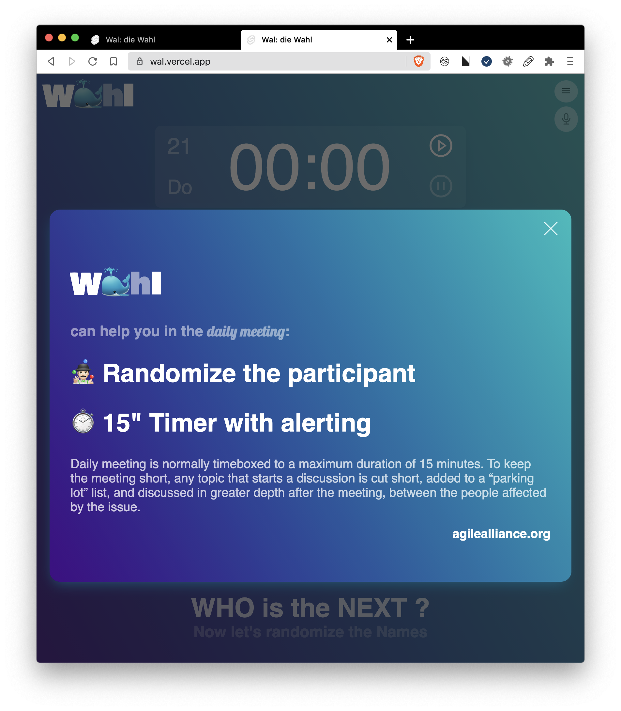
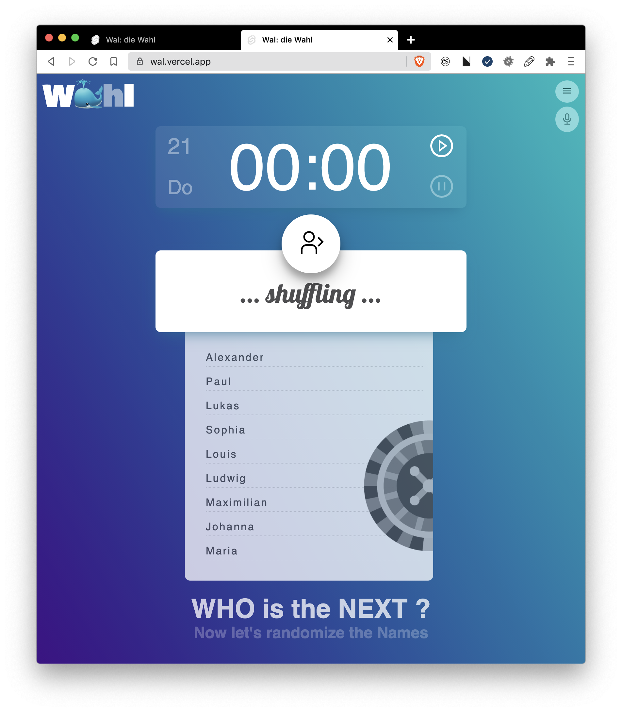
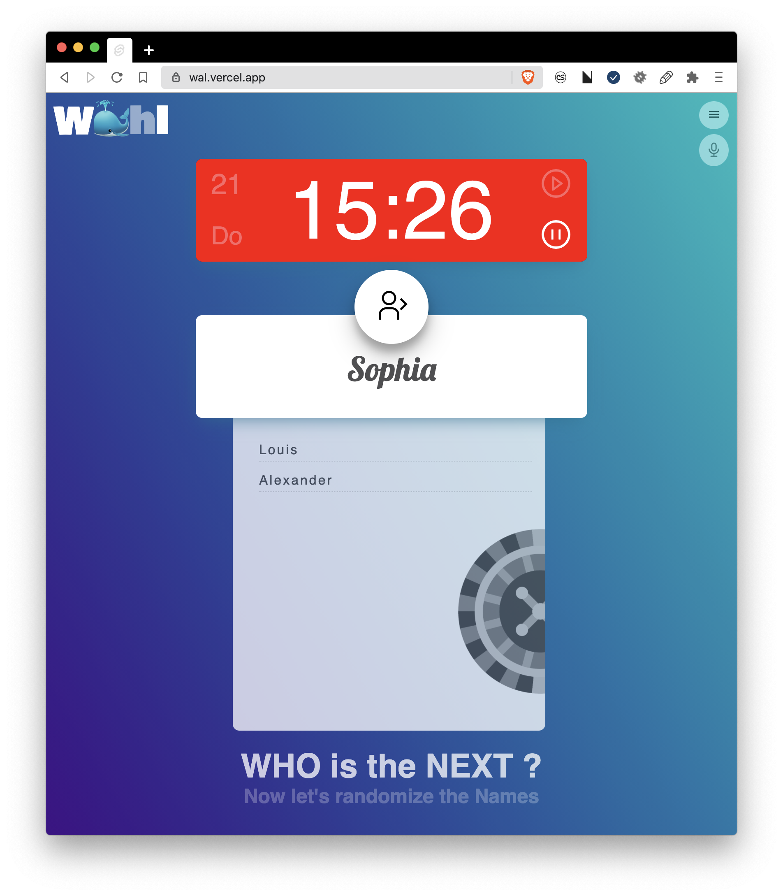

<div align="center">
  
  <h3>Wahl: a minimal randomizer for scrum daily standup</h3>
  <p>
    <a href="#">
      
    </a>
    <a href="#">
      
    </a>
    <a href="#">
      
    </a>
    <a href="https://github.com/vikbert/sests">
      
    </a>
  </p>
</div>

---

# 🐳 What ist Wa(h)l?

Wa(h)l is a german word(engl: decision).
> DUDEN: Möglichkeit der Entscheidung; das Sichtentscheiden

If we remove this character "h", and it becomes another word "engl: whale" that is the most favorite animal of my son. The two words have almost the same pronunciation in German. At least, it sounds similar to me who speak German as the seconds foreign language. 😀


# ✨ Background
I build this application in the context of [#100DaysOfCode](https://www.100daysofcode.com/).

The idea of this application is inspired by someone's kindly suggestion during the scrum daily meeting, as we didn't know who is going to talk as next.

# ✅ Feature of app
- randomize the participants 
- text to speech
- a timer for the meeting: default 15" for a normal daily standup
- manage the participants for the meeting





<div align="center">
  <h3>Meeting time is exceeded</h3>  
</div>



# 🚀 Getting started
```bash
git clone https://github.com/vikbert/wal.git
cd wal
npm install
```

### Start Dev
```bash
npm run dev
```

### Start tests
```bash
npm run test 
```

# Todo:
- add projects and order the participants by projects

# licence

MIT [@vikbert](https://vikbert.github.io/)
